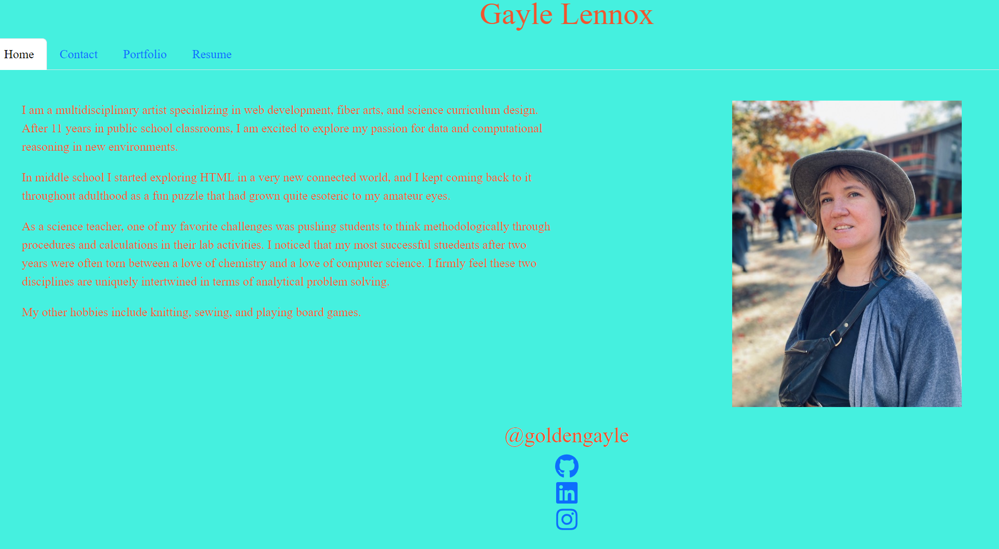

## React Portfolio Project (Module 20)

## Introduction
This project demonstrates use of React components to showcase my portfolio. AS A USER I want to find more information about a job applicant to determine if they are a good fit for the offered position. <a href="https://goldengayle.github.io/ReactPortfolio/">Link to Portfolio</a>

  

## How it was made
This project utilizes Node v16 and React. 

## Optimizations
In the future,I would like to add more styling to this portfolio. I also need to work on the fdetail added to my portfolio to better attract potential employers. 

## Lessons Learned
I really like the systematic way that React organizes information to make an efficient appllication. This project helped me learn that I reaally need to reach out to my community to better style wesbites..

## Credits
All code was modified from class exercises by  @goldengayle. I also used the following tutorials to help me:
Adding social media icons: <a href="https://www.digitalocean.com/community/tutorials/creating-a-social-follow-component-in-react">https://www.digitalocean.com/community/tutorials/creating-a-social-follow-component-in-react</a>
Displaying 2 div's side-by-side : <a href="https://coder-coder.com/display-divs-side-by-side/">https://coder-coder.com/display-divs-side-by-side/</a>
Adding a downloadable file: <a href="https://www.geeksforgeeks.org/how-to-download-pdf-file-in-reactjs/">https://www.geeksforgeeks.org/how-to-download-pdf-file-in-reactjs/</a>

## License
MIT License
Copyright (c) 2023 goldengayle
Permission is hereby granted, free of charge, to any person obtaining a copy of this software and associated documentation files (the "Software"), to deal in the Software without restriction, including without limitation the rights to use, copy, modify, merge, publish, distribute, sublicense, and/or sell copies of the Software, and to permit persons to whom the Software is furnished to do so, subject to the following conditions:
The above copyright notice and this permissio
